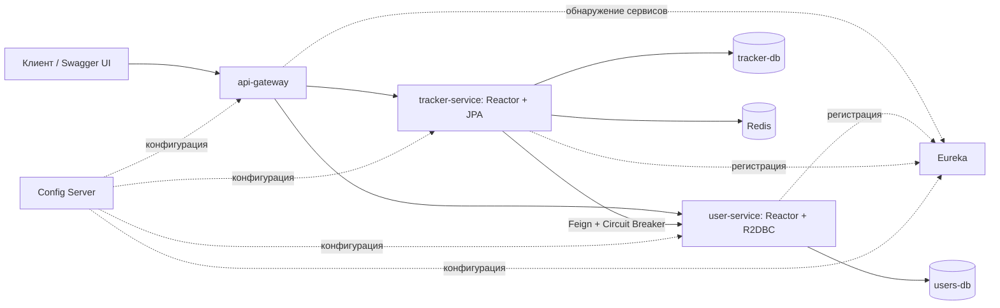

# План реализации ЛР №2

Статус: структура Maven, Config Server, Eureka и Gateway реализованы.
Политика логического удаления пользователей подтверждена. User-service выделен
на Reactor/R2DBC; tracker-service использует Feign; Gateway направляет запросы
в два бизнес-сервиса. Перевод tracker-service на Reactor/WebFlux и Circuit Breaker
остаются следующими этапами.
Основа: текущий монолит ЛР №1, ветка `main`, Java 21, Spring Boot 3.5.6,
Maven, PostgreSQL, JPA, Liquibase, Redis, OpenAPI, JUnit и Testcontainers.

Выполнено на первом этапе:

- Исправлены устаревшие URL существующих тестов: `/api/...` → `/api/v1/...`.
- Создан parent/агрегатор Maven; исходники, ресурсы и тесты перенесены в
  `tracker-service`. Пользователи пока остаются внутри монолита.
- Обновлены Dockerfile, `.dockerignore` и команды сборки в README.
- `mvn clean verify` на Java 21: 114 unit- и 32 integration-теста проходят,
  покрытие строк текущего модуля 90.43%.
- `docker compose config --quiet` и `docker compose build app` проходят.
  Полный Compose-стек на этом этапе не запускался.

Выполнено на втором этапе:

- Добавлены модули `config-server`, `discovery-server` и Spring Cloud BOM 2025.0.3.
- Config Server читает `config-repository` через native backend. Tracker и
  Eureka загружают общие и индивидуальные настройки при старте. Bootstrap
  Config Server остаётся локальным, чтобы исключить зависимость от самого себя.
- Tracker и Config Server регистрируются в standalone Eureka.
- В Compose добавлены зависимости по readiness, отдельные образы и параметры
  портов. Тестовый профиль tracker-service читает те же YAML из test classpath
  без сетевой зависимости от Config Server и Eureka.
- `mvn clean verify` на Java 21: 114 unit- и 32 integration-теста проходят;
  покрытие строк tracker-service — 90.43%. Это не агрегированный отчёт сервисов.
- `scripts/smoke-config-discovery.sh`: все три образа собраны, конфигурация
  загружена по HTTP, оба клиента зарегистрированы в Eureka со статусом UP,
  API трекера и БД доступны. Проверка выполнена в отдельном Compose-проекте;
  его контейнеры, сеть и volumes удалены после завершения.
- Проверен отказ runtime-запуска tracker-service при недоступном обязательном
  Config Server. Автоматическое обновление конфигурации работающих клиентов
  на этом этапе не включено.

Выполнено на третьем этапе:

- Добавлен `api-gateway` на Spring Cloud Gateway Server WebFlux с Config Client,
  Eureka и Spring Cloud LoadBalancer. Маршруты и Swagger настраиваются через
  `config-repository/api-gateway.yml`.
- Все текущие публичные `/api/v1/users`, `/projects`, `/tasks`, `/labels`
  и вложенные маршруты направляются в `lb://tracker-service`.
- Общий Swagger UI размещён на Gateway; tracker-service публикует только
  OpenAPI. Спецификация доступна через Gateway по `/v3/api-docs/tracker-service`.
  Server URL `/` направляет запросы на тот же origin, а PreserveHostHeader
  сохраняет внешний адрес в Location для текущего HTTP-развёртывания.
- В Compose добавлен отдельный образ и healthcheck Gateway. Скрипт запуска
  использует host-порт 58081; прежний прямой API трекера остаётся на 58080.
- `mvn clean verify` на Java 21: 114 unit- и 32 integration-теста проходят;
  покрытие строк tracker-service — 90.46%. Агрегированный отчёт ещё не добавлен.
- Smoke-проверка: Gateway получает конфигурацию по HTTP и зарегистрирован
  в Eureka со статусом UP; UI, JS/CSS и OpenAPI доступны. Проверены запросы
  через Gateway: создание, чтение и удаление данных, участники проекта,
  пагинация, feed, Location с адресом Gateway и ошибки 400/404.
  Проверка выполняет HTTP-запросы по server URL из спецификации; интерактивное
  нажатие Try it out в браузере отдельно не проверялось.
- Все четыре образа собраны; временные контейнеры, сеть и volumes smoke-проекта
  удалены после проверки. Бизнес-логика, схема БД и миграции не изменялись.

Промежуточный результат выделения user-service:

- Добавлен независимый модуль WebFlux + Reactor + R2DBC со своей схемой users-db,
  Liquibase, Config Client и Eureka Client. JDBC используется только Liquibase.
- Реализованы CRUD, пагинация с X-Total-Count и лимитом 50, валидация DTO/модели,
  строковые роли, timestamps, уникальность email и optimistic locking.
- DELETE скрывает пользователя, сохраняя строку и ID; повторное чтение/удаление
  возвращает 404. Email удалённого пользователя остаётся зарезервированным.
- Внутренний POST /internal/users/resolve возвращает активные ID и роли,
  принимает максимум 50 ID и скрыт из OpenAPI.
- 8 unit- и 8 integration-тестов проходят; покрытие строк user-service — 98.35%.
- Полный mvn clean verify на Java 21 проходит: 122 unit- и 40 integration-тестов.
- Compose-профиль user-service-preview запускает сервис и отдельную users-db.
  Docker-образ собран; изолированная runtime-проверка подтвердила загрузку
  Config Server по HTTP, регистрацию user-service в Eureka со статусом UP,
  CRUD, логический DELETE, внутренний resolve, пагинацию и OpenAPI.
  Временные контейнеры, сеть и volume удалены; рабочее окружение не менялось.
  Gateway пока направляет пользователей в прежний tracker-service, поэтому
  новый сервис проверяется напрямую и ещё не является основным хранилищем.
- Автоматическая проверка отклонила снятие трёх внешних ключей к users и пакетную
  переработку прежних тестов без отдельного подтверждения. Подготовленные
  изменения трекера сохранены в proposals/user-service-extraction; они не
  применены. Прежний код, тесты и миграции трекера восстановлены.

Выполнено продолжение выделения user-service после подтверждения пользователя:

- Удалён пользовательский CRUD/JPA-пакет из трекера. authorId, assigneeId и userId
  остаются числовыми ссылками; новая миграция снимает только три пользовательских
  FK. Прежние changesets, локальные FK и таблица users с её данными сохраняются.
- Feign проверяет активных пользователей и роль TEAM_LEAD через внутренний
  HTTP-контракт; адрес определяется Eureka/LoadBalancer. Проверки выполняются
  перед локальной транзакцией. Отсутствующий/удалённый ID — 404, неверная роль —
  409, транспортная ошибка или timeout — 503 без записи.
- Создание проекта вместе с участником и перенос задачи остаются локальными
  атомарными операциями. PostgreSQL IT проверяет rollback при ошибке записи
  участника; существующий сценарий отката переноса сохранён.
- Логическое удаление не меняет исторические ID задач/участников. Обновление
  текста задачи с прежними пользовательскими ссылками остаётся доступно;
  новые ссылки и выбранный исполнитель при переносе проверяются через Feign.
- Gateway направляет users в user-service, остальные API — в tracker-service.
  Общий Swagger UI содержит две спецификации. Внутренний resolve не публикуется.
- User-service и users-db включены в обычный Compose-запуск; скрипт docker-up.sh
  использует для прямого пользовательского API host-порт 58082.
- Прежние пользовательские unit-сценарии адаптированы в user-service;
  интеграционные CRUD/миграции/валидация/OpenAPI покрыты R2DBC UserIT.
  Трекерные IT используют реальный HTTP-stub Feign вместо локальной users-таблицы.
- Полный mvn clean verify на Java 21 проходит: 122 unit- и 42 integration-теста.
  Покрытие строк: user-service — 98.35%, tracker-service — 90.65%.
  Агрегированный отчёт ещё не добавлен.
- Добавлен scripts/migrate-users.py: явный импорт в пустую users-db при
  остановленных приложениях, с сохранением ID/дат, настройкой sequence,
  проверкой исторических ссылок и чтением результата. Исходные данные сохраняются.
  Применение на рабочей БД в ходе разработки не выполняется.
- Все пять Docker-образов собраны; обновлённый smoke-сценарий проходит в отдельном
  Compose-проекте. Проверены Config Server, четыре клиента Eureka UP, два API
  и общий Swagger, реальный Feign, 503 без записи при остановке user-service,
  восстановление, перенос задачи и история после удаления пользователя.
  Перенос данных проверен на ID 7000, прежних датах и имени со специальными
  символами; повторный импорт отклонён, новый ID больше 7000.
  Временные контейнеры, сеть и volumes удалены; рабочее окружение сохранено.

Следующий этап — перевод tracker-service на Reactor/WebFlux с изоляцией
блокирующих JPA, Feign и Redis. Circuit Breaker добавляется отдельным этапом.

## 1. Границы сервисов

Рекомендуемый вариант — два бизнес-сервиса и три инфраструктурных приложения.
В задании нет требования выделять отдельный сервис для каждой сущности.

| Приложение | Ответственность | Стек / данные |
| --- | --- | --- |
| `user-service` | Пользователи и их роли | WebFlux + Reactor + Spring Data R2DBC; `users-db` |
| `tracker-service` | Проекты, участники проектов, задачи, метки | WebFlux + Reactor + Spring Data JPA; `tracker-db`; Redis |
| `discovery-server` | Реестр экземпляров приложений | Eureka Server |
| `config-server` | Централизованная конфигурация | Spring Cloud Config Server |
| `api-gateway` | Единая точка входа и общий Swagger UI | Spring Cloud Gateway Server WebFlux |

Проекты и задачи остаются вместе, поскольку перенос задачи, проверка участника
проекта и запрет удаления используемого проекта относятся к одной области.
Метки остаются рядом с задачами: связь `task_labels` сохраняется локально.
Это сохраняет две сложные операции в обычных транзакциях и сокращает количество
сетевых вызовов. Выделение `project-service` возможно позже, но потребует отдельно
решать согласованность проектов, участников и задач.



## 2. Структура репозитория и зависимости

Один репозиторий и Maven multi-module:

```text
pom.xml                  # parent, BOM, версии, общие настройки проверок
discovery-server/
config-server/
api-gateway/
user-service/
tracker-service/
coverage-report/         # агрегированный JaCoCo-отчёт
config-repository/       # YAML, читаемые Config Server
docker-compose.yml
scripts/
```

Каждое приложение собирается в отдельный jar и Docker-образ. Внутри бизнес-сервисов
сохраняются контроллеры, DTO, сервисы, модели, мапперы и репозитории.
Сервисы не подключают jar друг друга и не используют чужие Entity/Repository.
Feign DTO принадлежат клиентскому адаптеру; согласованность HTTP-контрактов
проверяется тестами. Общий модуль с доменной моделью не вводится.

Сохранить Java 21. Базовый вариант с минимумом изменений — Spring Boot 3.5.x
и совместимая ветка Spring Cloud 2025.0.x. Перед реализацией выбрать конкретные
стабильные patch-версии и зафиксировать BOM; отдельно проверить springdoc,
Lombok, Testcontainers и JaCoCo. Эти ветки совместимы по официальной таблице,
но совместимость и актуальный срок поддержки — разные критерии выбора.

## 3. Reactor, R2DBC и JPA

### user-service

- Перенести CRUD пользователей на WebFlux и реактивные репозитории R2DBC.
- Контроллеры и сервисы возвращают `Mono` / `Flux`; не применять `.block()`
  в обработке запроса и не оборачивать JDBC вместо использования R2DBC.
- Пагинация: отдельные запросы данных и количества; сохранить максимум 50
  записей и `X-Total-Count`. Публичный список остаётся JSON-массивом.
- Заменить JPA-аннотации модели на Spring Data Relational; явно обеспечить
  валидацию модели, timestamps, строковые enum и перевод нарушений уникальности
  в 409. R2DBC не выполняет Hibernate lifecycle callbacks.
- Реактивные транзакции выполнять через `R2dbcTransactionManager` /
  `TransactionalOperator` либо корректно настроенный реактивный `@Transactional`.
- Liquibase запускается через отдельное JDBC-подключение при старте;
  рабочие запросы приложения используют R2DBC.

### tracker-service

- Перевести HTTP-слой на WebFlux и Reactor; адаптировать ошибки и валидацию
  под WebFlux вместо servlet API.
- Сохранить JPA-репозитории и синхронные транзакционные бизнес-сервисы.
- Выполнять JPA-вызов лениво через `Mono.fromCallable(...)` и
  `subscribeOn(...)` на ограниченном scheduler для блокирующей работы.
  Вызов проходит через Spring proxy; открытие транзакции, чтение, запись и
  преобразование Entity в DTO выполняются в одном синхронном методе.
- Не ставить JPA `@Transactional` вокруг метода, который лишь возвращает
  отложенный `Mono`: обычная JPA-транзакция привязана к потоку выполнения.
- Feign и существующий блокирующий Redis-кэш тоже выполнять вне event loop.
  Число рабочих потоков и очередь ограничить, согласовать с размером DB-пула.
- Результат — реактивный HTTP-слой с изолированным блокирующим доступом к БД;
  JPA при этом не становится неблокирующим.

До основной реализации подтвердить у преподавателя, что такой способ сочетания
Reactor и JPA соответствует последнему пункту ЛР №2.

## 4. Владение данными и бизнес-правила

`user-service` владеет таблицей `users`.
`tracker-service` владеет `projects`, `project_members`, `tasks`, `labels`,
`task_labels`. Для учебного Compose использовать два PostgreSQL-контейнера
с отдельными volumes и учётными данными. Доступ к чужой БД запрещён.

В `Task` заменить JPA-ссылки `author` / `assignee` на `authorId` / `assigneeId`,
в `ProjectMember` — ссылку `user` на `userId`. Внешние ключи к `users`
между БД отсутствуют. Существование пользователя и роль тимлида проверяются
через Feign до открытия локальной JPA-транзакции. Использовать пакетную проверку
ограниченного списка ID, чтобы не делать отдельный вызов на каждого пользователя.
Чтение задач и участников не требует обращения к user-service: текущие DTO
уже содержат ID пользователей.

Локальные связи `Project → Task`, `Project → ProjectMember` и
`Task ↔ Label`, уникальности, ограничения удаления и optimistic locking
сохраняются. `ProjectMember` продолжает представлять участие пользователя
в проекте с `joinedAt` и `active`, но это уже межсервисная логическая связь,
а не JPA Many-to-Many к удалённой Entity.

### Удаление пользователя — обязательное решение до переноса

Сейчас удаление пользователя, используемого в задачах, возвращает 409 благодаря
FK; участие в проектах удаляется каскадно. Эти гарантии нельзя просто перенести
в независимые БД.

Предложение для ЛР №2: логическое удаление пользователя, сохранение его ID
и исторических ссылок. Удалённые пользователи исключаются из публичного списка
и GET, повторное удаление возвращает 404; новые назначения отклоняются.
Исторические задачи и записи участия не удаляются каскадно. Email остаётся
зарезервированным. В гонке между проверкой и удалением допустима ссылка на
сохранённую историческую запись: проверка активности не является глобальной
транзакционной гарантией. Роль тимлида проверяется на момент назначения.

Это осознанное изменение поведения ЛР №1, требующее согласования до реализации.
Если необходимо сохранить прежний DELETE с 409 и строгий запрет конкурентного
назначения, понадобится отдельный протокол согласования операций. Проверка
«есть ли ссылки» через HTTP сама по себе гонку не устраняет.

Две локальные сложные транзакции:

1. Создание проекта и записи участника-тимлида: обе записи появляются вместе
   или обе откатываются. Проверка пользователя по сети предшествует транзакции.
2. Перенос задачи: проверка локального участника, изменение проекта/исполнителя,
   замена меток и проверка версии выполняются атомарно в `tracker-db`.

Удалённый вызов не включается в локальную DB-транзакцию. Межсервисная ACID
транзакция не заявляется.

## 5. Config Server, Eureka, Gateway, Feign и Circuit Breaker

- Config Server: native backend, YAML из `config-repository/`, смонтированных
  в контейнер. Это не требует отдельного удалённого Git-репозитория.
- Бизнес-сервисы, Gateway и Eureka получают конфигурацию через
  `spring.config.import=configserver:...`. Для Compose Config Server обязателен;
  локально остаются имя приложения, адрес Config Server и параметры bootstrap.
- Config Server стартует независимо от Eureka. Порядок запуска: Config Server,
  Eureka, бизнес-сервисы, Gateway; PostgreSQL должен быть готов к запуску
  соответствующего бизнес-сервиса. Readiness и retries учитывают, что доступность
  Eureka ещё не означает завершённую регистрацию сервисов.
- Eureka-клиенты: бизнес-сервисы, Gateway и Config Server. Сам Eureka Server
  работает в standalone-режиме без регистрации в себе.
- Gateway маршрутизирует `/api/v1/users/**` в `lb://user-service`,
  `/api/v1/projects/**`, `/api/v1/tasks/**`, `/api/v1/labels/**` в
  `lb://tracker-service`. Маршрут проектов включает вложенные `/members`.
- Feign в tracker-service использует имя `user-service`, Eureka и Spring Cloud
  LoadBalancer; адрес конкретного контейнера в клиенте не фиксируется.
- Ввести ограниченный внутренний HTTP-контракт проверки пользователей/ролей;
  внутренние маршруты не публиковать через Gateway.
- Circuit Breaker: Spring Cloud CircuitBreaker + Resilience4j вокруг Feign.
  Настроить connect/read timeouts и состояния CLOSED / OPEN / HALF_OPEN.
  Доменные ответы 404/409 не должны учитываться как инфраструктурный отказ.
- При отказе user-service операции, требующие проверки пользователя, возвращают
  человекочитаемый 503 и не записывают данные. Не подменять результат успешной
  проверки фиктивным пользователем. Автоповторы изменяющих операций не включать.
- Список/чтение задач без проверки пользователя продолжает работать.
  Отказ Redis сохраняет существующее поведение работы без кэша.

## 6. Сохранение контрактов ЛР №1

Сохранить `/api/v1`, DTO, успешные HTTP-статусы, ошибки, лимит 50,
`X-Total-Count`, cursor feed и `X-Next-Cursor`, optimistic locking и фильтры задач.
Изменения удаления пользователей описать отдельно в документации и тестах.

Swagger UI находится на Gateway и содержит спецификации обоих сервисов.
Это один интерфейс с выбором спецификации; объединённый JSON OpenAPI не нужен.
Проксировать `/v3/api-docs` сервисов по отдельным адресам, настроить OpenAPI
`servers`, чтобы Try it out отправлял запросы на Gateway.
Адаптировать `GlobalExceptionHandler` и `ControllerContractTest`:
проверять `Mono<ResponseEntity<...>>` вместо требования сырого `ResponseEntity`.

У каждой БД собственный Liquibase changelog. Старые применённые changesets
монолита не редактировать. Для новых БД подготовить свои начальные миграции.
Если нужны текущие данные, отдельно перенести их с сохранением ID, timestamps,
версий и настройкой sequence; проверить количества и ссылки. Старый PostgreSQL
volume сохранить. Для учебного запуска с новыми данными перенос не обязателен.

## 7. Порядок реализации

Каждый этап выполняется отдельной feature-веткой и проверяется перед следующим.
Коммиты — Conventional Commits. Исходную версию ЛР №1 сохранить тегом после
проверки рабочего дерева; существующие пользовательские изменения не включать.

| Этап | Работа | Критерий завершения |
| --- | --- | --- |
| 0 | Зафиксировать границы, DELETE, трактовку Reactor + JPA, версии и необходимость переноса данных | Записаны архитектурные решения и целевые контракты |
| 1 | Создать Maven-модули, сначала перенести монолит целиком в tracker-service | Существующие тесты и сборка проходят после переноса |
| 2 | Добавить Config Server, Eureka и Gateway; пока один бизнес-сервис | Конфигурация загружается, сервис виден в Eureka, REST работает через Gateway |
| 3 | Выделить user-service с R2DBC и отдельной БД; заменить локальные UserService-вызовы на Feign | CRUD, проверки ролей и выбранная политика DELETE работают между сервисами |
| 4 | Перевести tracker-service на Reactor/WebFlux с изоляцией JPA, Feign и Redis | HTTP-контракты сохранены; обе сложные транзакции проверены на rollback |
| 5 | Добавить Circuit Breaker и обработку отказов | Проверены timeout, OPEN, HALF_OPEN, восстановление и отсутствие лишних записей |
| 6 | Завершить общий Swagger, Compose, документацию и общие проверки | Полная система собирается и проходит приёмочные сценарии |

Этапы 3–4 требуют промежуточных адаптеров, поэтому не следует одновременно
переписывать всю бизнес-логику, миграции и HTTP-контракты.

## 8. Проверки и критерии сдачи

- Unit-тесты нормализации, валидации, мапперов, бизнес-правил и обработки ошибок.
- R2DBC: WebTestClient, StepVerifier, PostgreSQL Testcontainers; миграции,
  CRUD, уникальность email, enum, timestamps, выбранный DELETE, пагинация.
- JPA: PostgreSQL Testcontainers; создание проекта с участником и rollback,
  перенос задачи и rollback, конфликт версии, фильтры, метки, ограничения удаления.
- Feign: HTTP-stub (например WireMock) для успешной проверки, 404,
  неверной роли, timeout и 5xx. Отдельно тест реального межсервисного сценария.
- Circuit Breaker: проверить реальные переходы состояний с короткими тестовыми
  интервалами, восстановление и исключение бизнес-ошибок из статистики отказов.
- Сквозной Compose-сценарий: создать пользователя → проект → задачу → метки →
  перенести задачу; все публичные запросы направлены на Gateway.
- При временном отказе user-service зависимая запись возвращает 503 без
  частичных данных; независимое чтение задач работает; после восстановления
  запрос снова проходит. Выполнять в отдельном тестовом Compose-окружении.
- Проверить реальную загрузку конфигурации из Config Server и регистрацию
  приложений в Eureka, а не только наличие зависимостей в pom.xml.
- Проверить Swagger Try it out, HTTP-статусы, ошибки, заголовки и лимит 50.
- `mvn clean verify`: unit + integration; агрегированный JaCoCo минимум 70%
  по строкам, с контролем покрытия бизнес-модулей. Искусственно снижать
  знаменатель исключением бизнес-кода не следует.
- `docker compose config` и `docker compose up --build`: отдельные образы,
  healthchecks, переменные среды, сохранение данных после перезапуска.

Для защиты подготовить диаграмму владения БД, таблицу соответствия требованиям,
два объяснения локальных транзакций, демонстрацию R2DBC и изоляции JPA,
сценарий отказа Circuit Breaker и итоговый отчёт покрытия.

## 9. Источники технических решений

- [Совместимость Spring Boot и Spring Cloud](https://spring.io/projects/spring-cloud/).
- [Spring Cloud OpenFeign: discovery, load balancing, Circuit Breaker и reactive limitations](https://docs.spring.io/spring-cloud-openfeign/reference/spring-cloud-openfeign.html).
- [Reactor: изоляция синхронных блокирующих вызовов](https://projectreactor.io/docs/core/release/reference/faq.html).
- [Spring Boot 3.5: инициализация БД и Liquibase](https://docs.spring.io/spring-boot/3.5/how-to/data-initialization.html).
- [Config Server: native filesystem backend](https://docs.spring.io/spring-cloud-config/reference/server/environment-repository/file-system-backend.html).
- [Config Client: spring.config.import](https://docs.spring.io/spring-cloud-config/reference/client.html).

Ссылки на текущую документацию Spring Cloud описывают механизмы; точные имена
starter-зависимостей и свойства проверить для выбранного release train.
